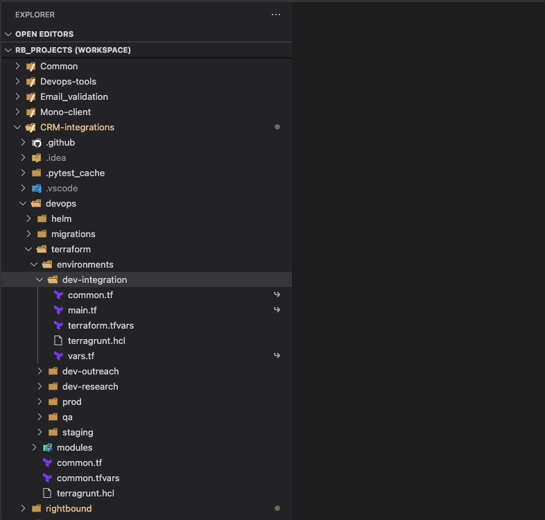

## Description

This is a lightweight [Visual Studio Code](https://code.visualstudio.com/) [extension](https://marketplace.visualstudio.com/) that provides the ability to open the source file of a symbolic link in the editor.

## Usage

Right click on the file with symbolic link, and choose: "Open real file path", in order to open the original file in the editor. 

## Contributing

Contributions are welcome! If you find any issues or have suggestions for improvements, please submit them in the issue tracker.